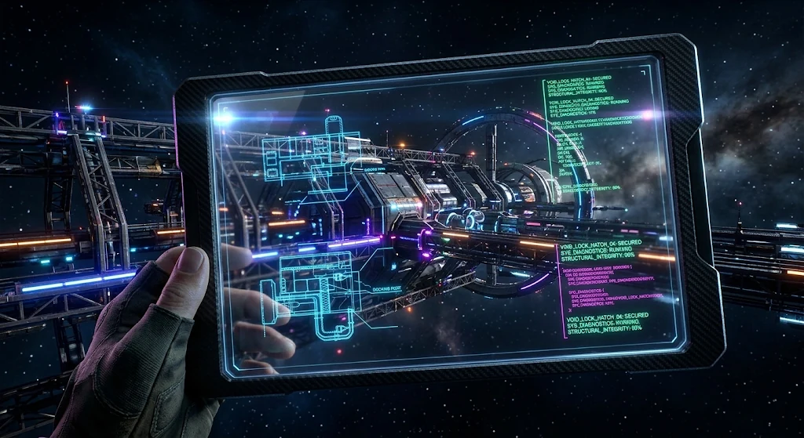

# Voidlock — Terminal Assets
**"Your assets are expendable. Your quarterly review is not."**



## Operational Overview

Blind corners. Fog of war. A 60-second delay on the extraction shuttle.

Voidlock is a real-time tactical meatgrinder where you remote-pilot marines through derelict hulls to secure proprietary technology. Your biological assets explore and fight autonomously — your role is strategic intervention: redirecting, changing engagement policy, or calling for retrieval before the swarm overruns the deck.

Every lost unit is a budget deduction. Every recovered artifact is a bonus. The swarm doesn't care about your quarterly targets.

## Terminal Features

- **Autonomous Assets**: Your units are trained and competent. They explore, open doors, and engage hostiles without your input. You intervene only when it matters.
- **Corporate Terminal**: A keyboard-driven menu interface. No click-to-move. This is a remote operations feed on corporate-issue hardware, not a video game.
- **Deterministic Simulation**: Every operation is reproducible. Same seed, same outcome. Replay the tapes to analyze asset loss.
- **Procedural Derelicts**: Each hull is a unique architectural puzzle. Tight corridors, blind corners, and lethal chokepoints.
- **Roguelite Contracts**: Multi-mission campaigns with persistent roster, equipment, and budget management.

## Deployment

**[PLAY VOIDLOCK IN YOUR TERMINAL (GITHUB PAGES)](https://roman-kamyk.github.io/voidlock/)**

---

## Operator Resources (Development)

<details>
<summary>View Technical Specifications</summary>

### Prerequisites
- Node.js (v18+)
- npm

### Initialization
```bash
npm install
```

### Remote Feed Start (Dev Server)
```bash
npm run dev
```

### Diagnostic Simulation (Testing)
```bash
npm run test
```

### Asset Processing
```bash
npm run process-assets
```

### Tech Stack
- **Engine**: Custom deterministic simulation running in a Web Worker.
- **Interface**: Vanilla TypeScript + Custom JSX (no external frameworks).
- **Visuals**: HTML5 Canvas (Tactical Feed) + DOM (Terminal Chrome).
- **Validation**: Zod runtime schema validation for data integrity.

### Documentation
- [Architecture](./docs/ARCHITECTURE.md) - Deep dive into the engine and protocol.
- [Design Specification](./docs/spec/index.md) - Detailed GDD and Identity guide.

</details>
